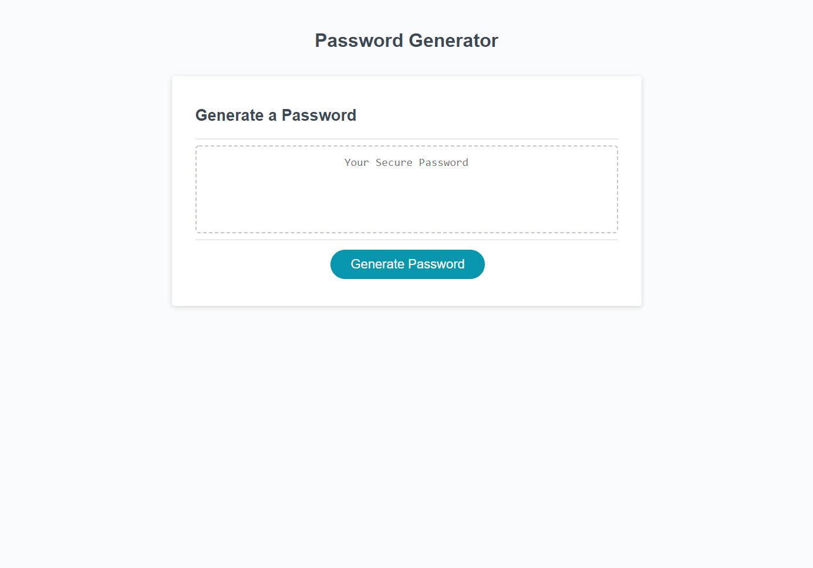

# Password-Generator

## Description

Provide a short description explaining the what, why, and how of your project. Use the following questions as a guide:

My motivation for this was to help make a new password without you having to think of one. I built this to make a harder password and also make it user friendly so that they can just follow the prompts. It solves the headache of thinking of a password. I learned a lot more about using Javascript.

## Installation

Open the link and you are already there. Just click "Generate Password" to start.

## Usage

Click "Generate Password" and follow the prompts that are given. Once done you will have your password generated which, you can just copy and paste. 

## Credits

Dom - https://github.com/dev-dominick

Kyle - https://github.com/kgiunta

Scott McAnally - Tutor

## License

N/A

## Badges

N/A

## Features

N/A

## How to Contribute

N/A

## Tests

N/A